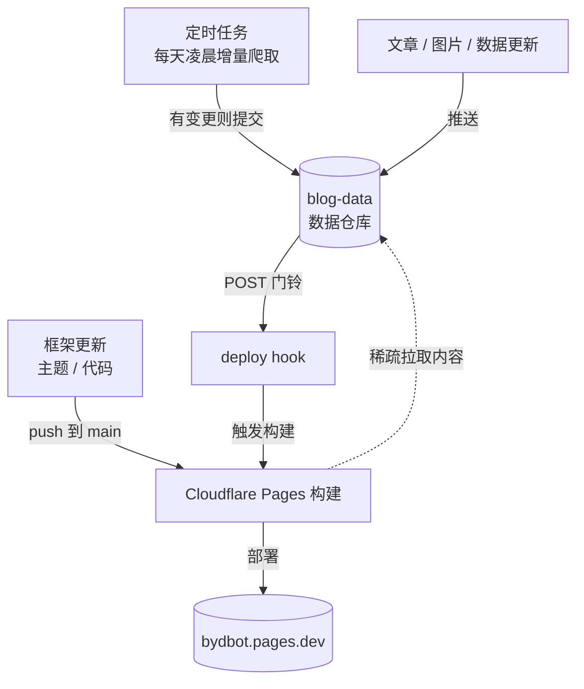

> 博客每次构建，都要把一千多条追番收藏挨个「登门拜访」一遍。不是我想这么勤快，是构建环境它记不住上次见过谁。

***

## 用了一个月，才发现每次构建都是全家福

博客上线后加了 Bangumi 数据同步，收藏、时间线都展示在页面上。图省事，抓取放在了构建里——每次构建开始，先抓一遍最新数据，再渲染页面。一天同步一次，等于一天构建一次，听起来挺顺理成章。

每次构建都要等 7 分钟。当时以为是正常现象便没深究。

***

## 自作聪明的增量

某天提交了一次push触发构建时看了一眼cloudfare，发现一段神必日志：

```
2026-09-03T15:45:28.925539Z ✓ Completed planned list processing

2026-09-03T15:45:28.925689Z Fetching type: 2...

2026-09-03T15:45:35.865938Z Fetched 50 records...

Fetched 100 records...

Fetched 150 records...

Fetched 200 records...

Fetched 250 records...

Fetched 300 records...

Fetched 350 records...

Fetched 400 records...

Fetched 450 records...

Fetched 500 records...

Fetched 550 records...

Fetched 600 records...

Fetched 650 records...

Fetched 700 records...

Fetched 733 records...

2026-09-03T15:49:19.028637Z [completed] Processing progress: 1/733 (234771)
```

我还寻思什么步骤需要用4分钟，一查才发现就是当初的bangumi数据同步——接口一次吐50条，一千多条得翻二十几页；而列表里只有摘要，页面上要用的封面、简介、制作公司这些细节，得再一条一条去拉详情接口。这就是日志里「Fetched 733 records」之后还要「Processing progress: 1/733」逐条过堂的原因，光「看过」这一类就有 733 条。秉持着减少bangumi服务器压力（最近你班服务器经常炸啊，两个月炸了两三回了）并且加速构建的想法，把抓取改成了增量：详情接口按「最后更新时间」判断，没变的直接复用旧数据，只有变了的才重新拉。逻辑写完了，本地跑一遍，快得感人。

推上去，云构建一看——还是全量。

我一个大调查下去，根因特别朴素：

> <span class="grad-text">アタシ、再生産。</span>

增量靠两个文件撑着，一份昨天的数据，一份时间戳账本。而这两个文件被 .gitignore 列在了黑名单里。云端的构建环境每次都是全新 checkout——特修斯之船，每次都是全新的自己。

改增量没用，不是增量不对，是它赖以生存的「记忆」根本进不了构建现场。

***

## 我们分手吧

站在岔路口：

- 把这两个文件解除黑名单，塞进仓库，让云端记得住。能行，但总感觉是在给构建环境补课——它今天记得住，明天又要防着它忘。

- 换一种思路：既然「每天都要更新的东西」和「几个月才动一次的代码」本来就是两种生命节奏，为什么非要住在同一个屋檐下？

果断选择分家，正好用了一个月自己的数据也有了一些，是时候进行框架和数据分离的重构了。

新建了一个数据仓库，专门住脏活累活：文章、图片、设备清单、技能树、睡眠数据、Bangumi 的原始数据和爬虫，还有那两个「记忆文件」，全部搬了进去。博客这边只剩框架——主题、组件、样式、配置文件，干干净净。

两边的配合方式也简单：构建的时候，博客先把内容仓库「牵线搭桥」拉一份回来，而且只拉自己要用到的几个目录，剩下的爬虫数据区碰都不碰。一顿操作，构建环境里的抓取环节整个消失了。

数据更新则搬去了数据仓库自己的定时任务：每天凌晨，增量爬时间线，增量爬收藏，富化详情，聚合出成品。有变化就提交推送，推送完按一下门铃——这个门铃就是 Cloudflare 的 deploy hook，一个网址，POST 一下，远程的博客构建就开始干活。文章更新也一样，推送完按门铃，即时上线。



> 三条路的更新最终都在构建现场汇合：爬虫产出的数据变更、手动写好的文章推送，先落进数据仓库，再由它按门铃呼叫构建；框架自己的代码改动则走原生直连，push 即构建。无论哪条路，构建时都会从仓库里把内容"牵线"过来渲染上线。

***

## turbo！

最直观的构建时间：

<style>
.grad-text{
	background:linear-gradient(90deg,#ff2e97 0%,#ff4365 25%,#ff6a36 50%,#ffa92e 75%,#ffd700 100%);
	-webkit-background-clip:text;
	background-clip:text;
	-webkit-text-fill-color:transparent;
	color:transparent;
	text-shadow:0 0 12px rgba(255,120,60,.35),0 0 28px rgba(255,215,0,.20);
}
.build-bars{display:flex;flex-direction:column;gap:.55rem;margin:1rem 0}
.bb-row{display:flex;align-items:center;gap:.7rem}
.bb-name{flex:0 0 9.5em;font-size:.875rem;white-space:nowrap}
.bb-track{flex:1;height:.9rem;border-radius:9999px;background:var(--btn-regular-bg);overflow:hidden}
.bb-fill{height:100%;border-radius:9999px;background:linear-gradient(90deg,oklch(.74 .13 var(--hue)),oklch(.48 .15 var(--hue)));transition:filter .15s}
.bb-val{flex:0 0 5em;font-size:.8125rem;font-weight:600;color:var(--tw-prose-headings);text-align:right;white-space:nowrap}
.bb-row:hover .bb-fill{filter:brightness(1.2)}
</style>

<div class="build-bars">
  <div class="bb-row"><span class="bb-name">全量重抓</span><div class="bb-track"><div class="bb-fill" style="width:100%"></div></div><span class="bb-val">7 分钟</span></div>
  <div class="bb-row"><span class="bb-name">小增量</span><div class="bb-track"><div class="bb-fill" style="width:29%"></div></div><span class="bb-val">2 分钟</span></div>
</div>

| 项目   | 重构前          | 重构后                  |
| ---- | ------------ | -------------------- |
| 博客仓库 | 代码+内容+数据一锅炖  | 只剩框架，瘦身一大截           |
| 数据版本 | 生成物不入库，丢了就重抓 | 原始数据、成品、增量账本全部入库，可回溯 |

> 增量失败不是终点，是个路标——它指的路不是「把记忆塞进构建环境」，而是「数据本来就不该住在构建里」。需要每天呼吸的东西，就该有自己的家。

