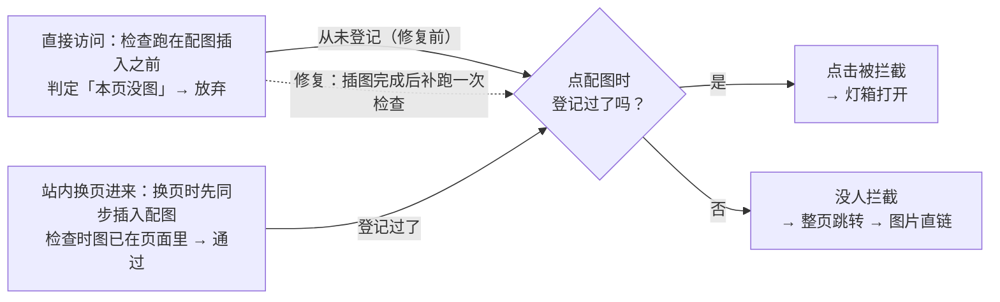
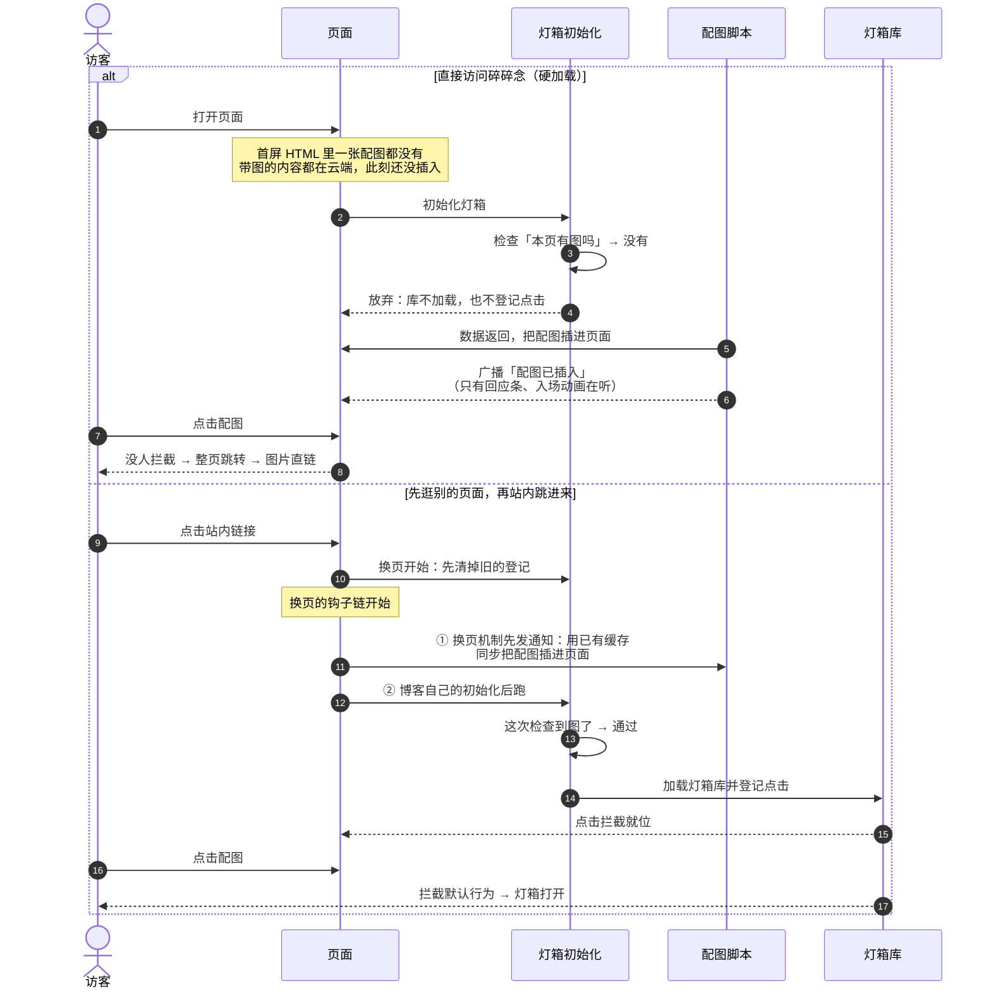
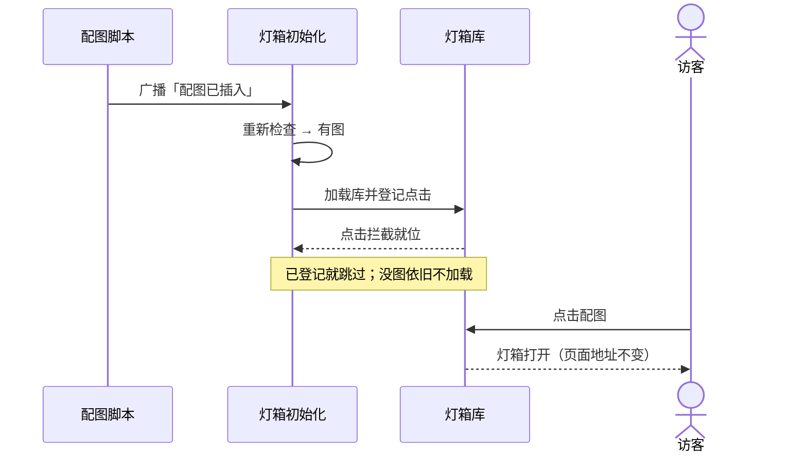

博客上有个小 bug：**直接打开碎碎念页面，点配图会整页跳到图片直链、灯箱不弹；先从别的页面点进来，灯箱又正常。**

正好两家的额度都是白嫖的（ds 走 workbuddy 国际版反代，glm 是活动送的），就顺手做了个同题横评：把修复提交藏起来、导出一份**修复前的代码快照**，看谁能把根因挖出来、挖得多深。

> 选手名单（两种模型 × 不同思考档）：**dsv4.1f 关思考** / **ds 低** / **ds 高** / **ds max** / **glm5.3f 低** / **glm5.3f 高**。

## 这个 bug 是怎么回事

>  不是灯箱坏了，而是「检查有没有图」跑在了「图出现」之前，而且不回头。

1. 灯箱是懒加载的：页面加载时先扫一眼「这一页有没有能开灯箱的图」。没有就收工——库不加载、点击拦截也不登记，而且**不会重试**。
2. 碎碎念的配图偏偏全是「迟到」的：仓库里存的旧碎碎念一条配图都没有，带图的内容都在云端，要等页面打开后异步拉回来、再由脚本插进页面。
3. 于是直接访问时：检查跑在配图插入之前 → 判定「本页没图」→ 放弃；等配图插进来，**已经没有任何人再检查一次**。
4. 而点击拦截只有在**「登记过一次」之后**才存在。没登记过，点击就落回链接的默认行为——整页跳到图片地址，也就是「直链看图」。
5. 那为什么「先逛别的页面再进来」就好了？站内换页时，两段脚本的接力顺序恰好有利：换页机制自己的通知先跑（此时用上一页已经取到的缓存数据，**同步**把配图插进页面），博客自己的初始化后跑——检查这次跑在图已经在页面里之后，登记成功。
6. 但这条「能用」的路本身很脆：如果这是本次会话第一次进碎碎念，负责插图的脚本还没加载，这个顺序就不成立。

## 要点

1. **不是「认不出」，是「查得太早」**：灯箱的检查规则本来就能认出碎碎念的配图标记，问题不在识别、在时机。（唯一答错的选手把它说成了「规则不覆盖」）
2. **点击拦截有个前提**：代码注释里那句「动态插入的图会自动生效」省略了前提——得先登记过一次。直接访问的路径恰恰没登记。
3. **「换页就能用」是巧合，不是规律**：它靠的是「上一页已经把数据拿到（缓存是热的）」加上「换页时两段脚本的执行顺序恰好有利」，缺一不可，本身不牢靠。
4. **修复落点**：挂在「配图插入完成」的信号上补跑，既补上了漏掉的登记，也保住了「没图就不加载」的懒加载。（修复已落地实测：两条路径都能正常开灯箱，无图页面依旧不加载灯箱库）

## 实测结果

|               | 选手一         | 选手二           | 选手三         | 选手四        | 选手五           | 选手六           |
| ------------- | ----------- | ------------- | ----------- | ---------- | ------------- | ------------- |
| 模型 · 思考档      | dsv4.1f · 关 | ds · 低        | glm5.3f · 低 | ds · 高     | glm5.3f · 高   | ds · max      |
| 耗时            | **1m19s**   | 2m45s         | 5m06s       | 3m44s      | 13m21s        | 7m06s         |
| token         | **6.0万**    | 6.9万          | 6.1万        | 10万        | 7.8万          | 15.6万         |
| 结论正确性         | ❌           | ✅             | ✅           | ✅          | ✅             | ✅             |
| ① 认出配图（是时机问题） | ❌ 说成认不出     | ✅ 点名          | ✅           | ✅          | ✅             | ✅             |
| ② 登记机制的前提     | ❌ 理解反了      | ✅             | ✅           | ✅ 翻过灯箱库的实现 | ✅             | ✅ 翻过灯箱库的实现    |
| ③ 换页为何能用      | ❌ 机制编错      | ✅ 讲清顺序        | ✅           | ✅ 实证＋点出脆性  | ✅ 顺序＋代码内证据    | ✅ 源码实证＋反证推论   |
| 独有增量          | —           | 点名单条规则、排除侧栏干扰 | —           | 翻库实现、脆性预警  | 修复方向、顺序的代码内证据 | 反证式推论、发布包源码核实 |
| 综合            | 不通过         | 通过（最省）        | 通过          | 通过（最深）     | 通过            | 通过（最严谨）       |

## 附：三张图看懂

> 骗你的，三张图也看不懂

**成败分岔只有一处**：点配图的那一刻，点击拦截登记过没有。

**两条路径的时序对比**（修复前：直接访问必坏，换页回访侥幸能用）：

**修复后的流程**（插图完成后补跑一次检查；已登记就跳过，没图依旧不加载）：

