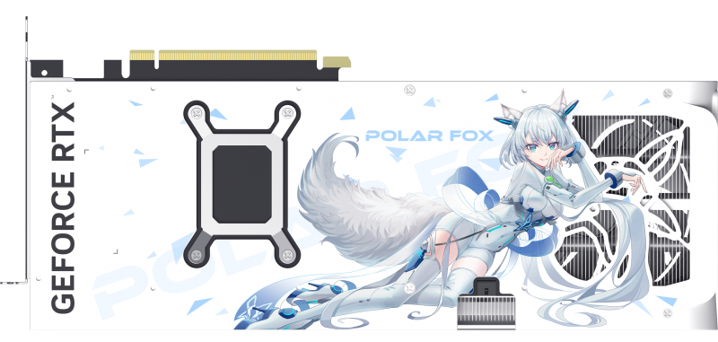

> 鸡哥陪我度过了 4 年大学，在 AI 方面逐渐力不从心了，正好要读研了，于是台式机便提上日程。

---

# 为这碟醋包的饺子

最先确定的是显卡：想跑大模型和 ComfyUI，显存要大，算力也要尽量高一点。四五月份的时候就想买 5070Ti，结果五一和 618 都有 6000 多的价格，没下手。显卡价涨着涨着，到后来只能看看 5070 了；再看 5060Ti 16G？涨飞了，也就显存大一点，核心都被拉爆了（引申阅读：[【极客湾】显卡的成本是核心大小决定的吗？](https://www.bilibili.com/video/BV1TfR5YwEsb)）。

看了半天，感觉价格还不如 618 的时候，于是决定去闲鱼买。既然都上闲鱼了，那就不玩 5070 了，直接上 5070Ti——正好碰上了个 6400 块的二次元皮：万丽雪狐，价格还可以，就下手了。

| 显卡型号            | 核心代号      | CUDA核心数 | 显存容量    | 显存类型  | 显存位宽    | 显存带宽      | 功耗 (TGP) |
| --------------- | --------- | ------- | ------- | ----- | ------- | --------- | -------- |
| **RTX 5090**    | GB202-300 | 21760   | 32 GB   | GDDR7 | 512-bit | 1792 GB/s | 575 W    |
| **RTX 5080**    | GB203-400 | 10752   | 16 GB   | GDDR7 | 256-bit | 960 GB/s  | 360 W    |
| **RTX 5070 Ti** | GB203-300 | 8960    | 16 GB   | GDDR7 | 256-bit | 960 GB/s  | 300 W    |
| **RTX 5070**    | GB205     | 6144    | 12 GB   | GDDR7 | 192-bit | 672 GB/s  | 250 W    |
| **RTX 5060 Ti** | GB206     | 4608    | 8/16 GB | GDDR7 | 128-bit | 448 GB/s  | 180 W    |
| **RTX 5060**    | GB206-250 | 3840    | 8 GB    | GDDR7 | 128-bit | 448 GB/s  | 145 W    |
| **RTX 5050**    | GB207     | 2560    | 8 GB    | GDDR6 | 128-bit | 448 GB/s  | 130 W    |

---

# 硬

## 转折点 · 1

CPU 这边，年初看到极客湾关于英特尔 Ultra 系列处理器的视频，感觉非常牛逼，一开始就往 Ultra 去找了。第一个看的就是 Ultra 7 270K Plus，20 多个核心，感觉非常强；后面跟 GPT 和 DeepSeek 深入交流了一番，发现可能不需要这么强的核心，而且有点贵，就降级到 265K Plus，最后降到 250K Plus，下单了 250K Plus 加铭瑄的 B860M Cross Pro——铭瑄这块二次元板子的屏幕实在太戳我了。

但研究内存的时候发现，英特尔的 CPU 特别是 Ultra 这一代，特别吃高频内存，动不动就要 7000、8000 往上超，而且这还是现在的 DDR5，对内存预算提出了非常高的要求，想买那种频率特别高的，基本上价格下不来。于是看了看 AMD 阵营，结果发现 AMD 不要求高频，同时功耗给我看呆了：9700X 的 TDP 是 65W，英特尔这边动不动就往 100W 上面超。衡量了发热、功耗，以及最重要的能效比，觉得 AMD 这边应该要强一点，所以赶紧把这个 CPU 和主板退了，买了 9700X。

## 转折点 · 2

选 AMD 主板的时候，本来想走二次元风，依旧选铭瑄的 B850M 瑷珈。但与此同时，我在闲鱼上淘到了一根光威 6400C32 的 24G 单条 DDR5 内存，海力士 M-die 颗粒，1500 元。卖家说是 AMD 平台不兼容这根条子，所以卖得比较便宜；我查了一下卖家主页，发现他也卖一个 9700X，就想：不会 AMD 新平台真用不了这根条子吧？于是去查铭瑄官网对应主板的内存兼容性，发现铭瑄并没有把这根条子列进兼容性列表，这下不得不放弃铭瑄的板子了。

其实刚开始选板子的时候，就注意到铭瑄的瑷珈、华硕的小吹雪和微星的刀锋钛，当时因为小吹雪断流（无线网卡和有线网卡都断），就在铭瑄和微星这两块板子里二选一；最后想的是铭瑄这块板子有两根 PCIe 槽，以后可以插双显卡，所以就为了未来不一定存在的第二块显卡买了铭瑄的板子。经历了这番折腾，为了配这根内存，只能走微星的刀锋钛了，幸好铭瑄的板子还没到，赶紧退了板子，换成刀锋钛。机箱也从原来的 ATX 变成了 MATX，正好符合我对小机箱的渴望，本来一直在看爱国者那些海景房机箱，这下不得不选九州风神 CH270 竖式机箱了。

## 转折点 · 3

好不容易配件到齐，开始装机。装机那天下午其他配件都到了，但水冷还在派送中，等不及了，于是我和同学去楼下电脑店花 30 块买了一个青鸟散热器，回到家准备开装。差不多 2 点开始装，装了一个小时水冷到了，这下用不上青鸟那个垃圾散热器了；过一会儿最后的机箱也到了，只能舍弃“只装板子不进机箱”的战略，改成一口气装到机箱上。之后就是漫长的初体验：装到晚上 6 点差不多完成。

一插电、一开机——心肺骤停：自检灯卡 44，CPU 红灯、DRAM 黄灯。一搜，果然就是内存训练不通过卡自检，哈哈。尝试了各种方法，刷 BIOS、清 CMOS 都没用，事已至此只能吃饭吧，7 点多点才吃上了肯德基，心情复杂地吃完，也没吃多。

## 转折点 · 3.5

那天正好是 N 卡封仓消息传出的一天：装机前一天晚上显卡到了，因为机器配件都没齐，所以没测也没装；当天下午看到贴吧里有说要涨价的信息，结果晚上还真涨了，大概 8 点的时候涨了 100 块，到 11 点差不多就有两三百了。

装机那天，显卡的卖家让我赶紧收货，他要用这份钱去买新卡，然而现在新卡都已经涨了几百块，所以卖家也很急。但是我也很急啊——当天点不亮机子，显卡测不了怎么办？最后只能去楼下电脑店回收伏笔（今天上午刚去过电脑店）。在店里用垃圾 D4 平台、垃圾板子、垃圾机箱拷了一下显卡，10 分钟温度控制在 80 度以下，没毛病。

## 转折点 · 4

第 2 天。因为这根内存条是 6400 频率的，而且微星这块板子也在内存兼容性里明确支持它，所以抱着试一试的心态，想让老板用他的金百达 6000 内存条进 BIOS，然后手动锁频率到 6000，试试能不能让光威这根条子亮起来。结果尝试了 5600、6000、6400 三档锁频率，都没能让光威跑起来，这下实锤了，根本用不了。马上跟内存卖家沟通看能不能退，最后花 90 元当学费给退了。

随即当天就物色内存条，这下只能买新的了。也是在京东上看到了阿斯加特 24G（1888 元），当时价格下感觉还不是很贵就下单了。没想到就是上海本地发货（嘉定那边），第 3 天早上就到了。快递员送货上门的时候，我啪的一下惊醒，从床上啪的一下蹦起来，拿起内存条对着主板的内存插槽啪的一下狠狠插上。插电，开机，主板一“啪”——我*，成了，你过关！

---

# 软

## 抢鼠标了

硬件过关，然后就装系统，装完系统打驱动。可惜的是，打驱动的时候我首先想到的是去微星官网下载对应驱动，然而这个浓眉大眼的 Windows 啊，偷偷在后台把自己认为适配的驱动也下载装了：我打了一个 AMD 芯片组驱动，它也打了一个 AMD 芯片组驱动。然后在我打 N 卡驱动的时候它自动重启了，重启后屏幕直接黑了。排查半天，发现可能就是这个驱动问题。还好 Windows 安装过程中创建了还原点，还原之后让 Windows 自动打驱动，我不管它了，最后正常使用了。

## 看你不顺眼

受不了免费系统不能调个性化、还不时弹出“请激活 Windows”，秉持着安全和便宜的想法，淘宝花 45 元买了个华为 OEM 版的 Win11 家庭中文版。

## N T R

> 你的调色很好，不过下一秒就是我的了

因为怀念机械革命笔电的护眼模式色调，而台式怎么调都调不出来，于是尝试看能不能把预设偷过来：把鸡哥的预设导出成 256 级 LUT 曲线（完整 LUT CSV）搬到台式机上 1:1 复现。

本来是打算走 ICC 配置文件的路子，结果这沟槽的 Win11 校色加载器死活不加载自定义 LUT——颜色管理关联、校准状态 API、排除干扰软件都试了一遍，它只认自己 MS00 参数化曲线那一套格式。只能绕开系统自己动手：用 SetDeviceGammaRamp 把曲线直接灌进显卡 gamma ramp，再往启动文件夹放了个 VBS 脚本，开机自动拉 load_lut.py 加载曲线。

调试时一不小心还被老东西截胡了——之前为了还原鸡哥效果调试过的 MSI Center「真彩视界」也会写 ramp，谁后写谁赢，得先在 MSI Center 里关掉那个模块，不然每次开机就有好戏看了。

---

## 尾声

> 至此，鸡哥可以退休了——吗？
>
> 那可不成，乖乖地当副屏，继续服役！