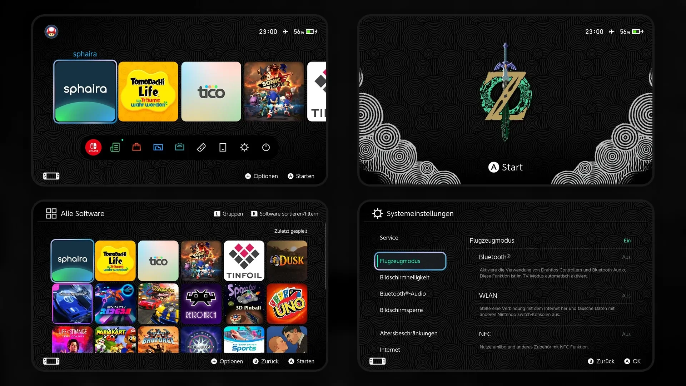
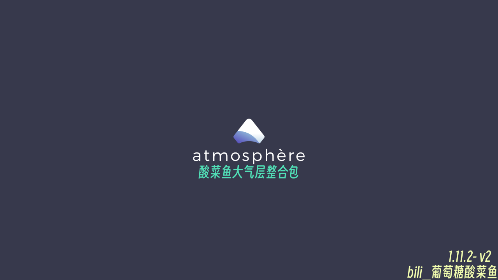
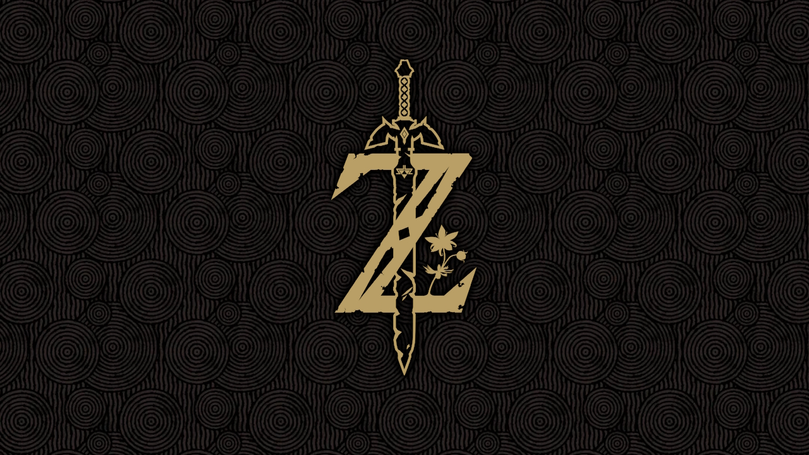
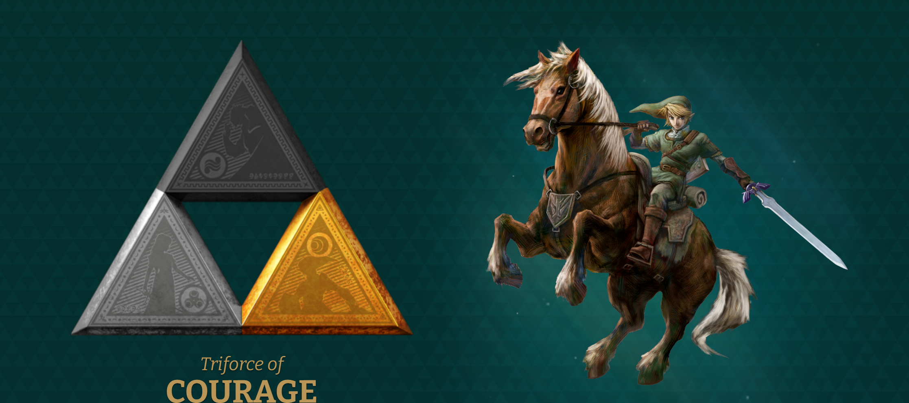
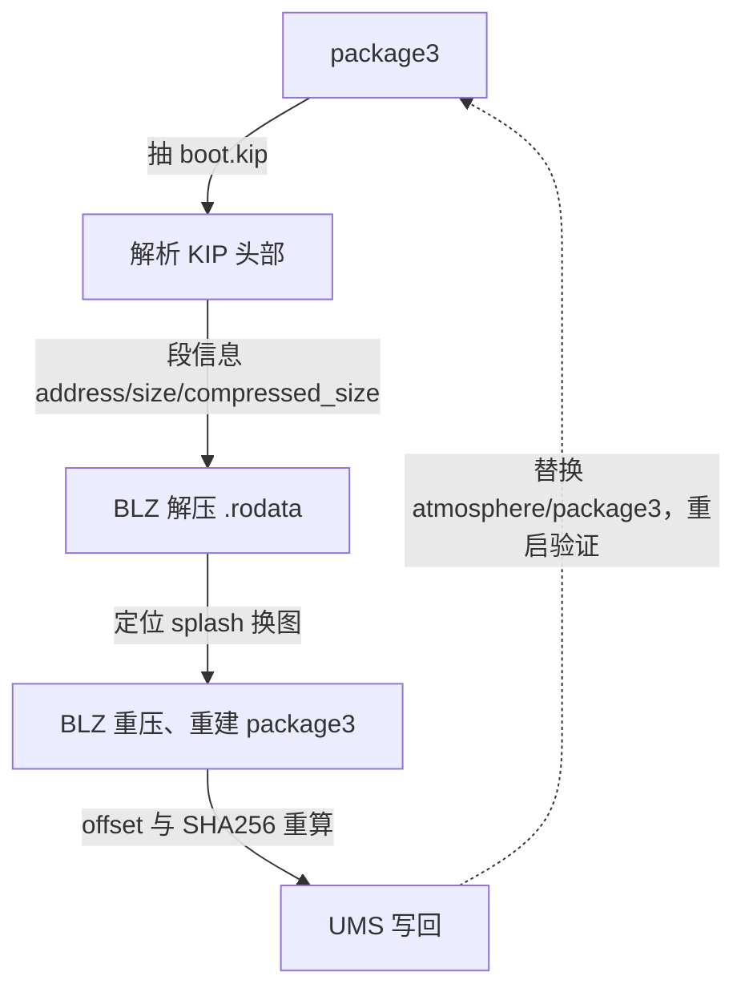

给 Switch 破解机（大气层 + emuMMC 虚拟系统，固件 22.5.0）做了一次完整的开机链路自定义：桌面主题换成王国之泪风格的 Zelda SW2，hekate 引导图也换成王国之泪徽记，最后把进系统前那 2 秒的大气层图标也换成了金色三角力量。

## 开机链路

| 阶段 | 原样 | 替换后 | 途径 |
| --- | --- | --- | --- |
| hekate 引导（3 秒） | 「酸菜鱼」品牌图 | TOTK 金徽记 | `bootloader/bootlogo.bmp` 文件级替换 |
| 进系统前（约 2 秒） | 大气层白色图标 | 金色三角力量 | boot.kip 二进制手术 |
| 桌面 | 原版界面 | Zelda SW2 主题 | NXThemesInstaller 安装 |

## 主题安装：Zelda SW2

Switch 主题的实质是替换系统桌面程序 qlaunch（title ID `0100000000001000`）的界面资源。主题文件从 [Themezer](https://themezer.net/) 下载，格式是 `.nxtheme`，安装走 NXThemesInstaller。

动手前有两个前置条件。第一，**补丁必须和固件严格对应**：主题补丁仓库 [exelix11/theme-patches](https://github.com/exelix11/theme-patches) 每次固件更新后都要等它放出对应的 IPS 补丁，版本不对会开机崩溃。22.5.0 在 2026-06-18 已支持，对应 IPS 文件名前缀 `26CC3BC5`，整合包卡上已经自带。第二，**安装器要用新版**：[NXThemesInstaller 3.0.1](https://github.com/exelix11/SwitchThemeInjector/releases)（2026-08-19 发布）。

在 Themezer 上翻了一圈，简约的设计很少，相中了 [Zelda SW2 主题包](https://themezer.net/switch/packs/zelda-sw2-234C)，一套 6 个部件，覆盖锁屏、头像选择、所有程序、主界面、设置、用户页：

安装流程：解压出所有 `.nxtheme` 放到 SD 卡 `themes/` 目录 → 进 hbmenu（自制程序菜单）打开 NXThemesInstaller → 允许它提取原版 home menu → 逐个界面安装 → 重启生效。

## hekate 引导图：删「酸菜鱼」、换 TOTK

整合包在 hekate 引导层塞了品牌图：`bootloader/boot.bmp` 和 `bootloader/bootlogo.bmp`（各 3,686,454 字节），外加 `bootloader/res/` 里 7 个未被引用的定制图标。先把这 9 个文件全部备份到电脑，再删卡上的原件。有几个文件不能误删：`bootloader/sys/nyx.bin` 和 `res.pak`（hekate 菜单的中文界面本体），以及 `icon_*_nobox.bmp`（启动配置实际引用的图标）。

酸菜鱼原版启动图：

换成塞尔达徽记（[Zelda - TOTK 启动图](https://themezer.net/switch/splashes/zelda-totk-4)，720×1280 32 位 BMP）：

### 一个白费功夫的文件名

把图以 `boot.bmp` 的名字传到卡上，SHA256 双端一致，`hekate_ipl.ini` 里 `bootwait=3` 也正常，开机显示的却还是 hekate 默认界面。

查 [hekate 源码](https://github.com/CTCaer/hekate/blob/master/bootloader/main.c) 后结论是文件名的锅：**hekate 只读 `bootloader/bootlogo.bmp`，`boot.bmp` 完全不读**。官方文档 [README_BOOTLOGO.md](https://github.com/CTCaer/hekate/blob/master/README_BOOTLOGO.md) 对格式有要求（32 位 BMP、不超过 720×1280、小于 4MB），但文件名没有第二个选择。

这个坑之前没暴露，是因为酸菜鱼时代两个文件都存在，hekate 实际用的是 `bootlogo.bmp`；删品牌图时两个一起删了，这次只传了 `boot.bmp`，自然不显示。用 UMS（USB 大容量存储模式，把 SD 卡挂成 U 盘直连电脑）把文件改名重传后就好了。

## 大气层 logo：boot.kip 二进制手术

> 进系统前的那张图前后换过两次：最初 we1zard 整合包的固件里是那个纯黑底、像素蓝字「MAGIC」的画面；换了官方 package3 之后，魔改的启动画面消失，变成了大气层原版白色图标；动了二进制手术之后换成了最后的金色三角力量。

主题和 hekate 画面改完了，秉持着来都来了，要改就改到底的想法，把进系统前那 2 秒的大气层图标也给干了。

### 图标来源

由于要搭配塞尔达主题，想搞一个三角力量，最初准备找的是野炊的乳白色三角力量，没有找到高清的资源，但是从官网 [The official home for The Legend of Zelda - About](https://zelda.nintendo.com/about/) 上看到非常有意思的表现方式，使用无敌的 F12 控制台给资源抓下来了。

因为金色的三个三角是分开单独的，图省事交给蓝色大肥鱼去拼接，结果搞了半天我一看最后的效果给我气笑了，算法竟然把三角的锈蚀痕迹也给去掉了。我一怒之下怒了一下，还能怎么办？自己手动来不是更快吗？几分钟的事。说干就干，使用 Windows 自带的画图工具，把这三个三角形，用了不到 10 分钟拼在一块儿了。

### 替换流程

替换时发现它没有文件级替换点——数据编译在 boot 模块（内核启动链的第一个 kip）里，来源是大气层源码 `stratosphere/boot/source/boot_splash_screen_notext.inc`（210×172 个 ARGB 像素，显示 2 秒，没有任何配置开关）。`exefs_patches` 对它也无效，因为 boot 是 kip 不是 exefs 模块。

只能走二进制手术这条路，动手前先认清两个绕不开的限制：

- **尺寸锁死 210×172**。渲染代码把数据当固定 36,120 像素来画（位置 X=535, Y=274 硬编码），不读尺寸信息。改尺寸等于改代码重新编译。所以图要先适配进 210×172 画布（等比缩放 + 黑边）。
- **数据不是明文**。boot.kip 的段是 BLZ 压缩的，压缩格式是 Nintendo BLZ 的一个变体，大气层有自己的实现。

这两条限制把方案定死了：先把 boot.kip 里的 splash 解压出来、原位换图、再按原格式压回去。完整流程：

> 步骤拆开看：

1. 从 package3 抽出 boot.kip（头部 content meta 记录每个组件的偏移和大小）。
2. 解析 KIP 头部（`InitialProcessHeader` 结构）：每段有 address/size/compressed_size 三字段，段数据按 compressed_size 串行排布。
3. BLZ 解压 `.rodata` 段。
4. 定位 splash：解压后 `.rodata` 段偏移 `0x22A70`，用源码数组的特征搜出来的。
5. 换图：三角力量 → 210×172 黑底 ARGB（A=0xFF、小端 u32）原位替换。
6. BLZ 重压 + 重建：更新 KIP 头部 ro_compressed_size，后续 kips 位置重排，所有 offset 和 SHA256 重算。
7. UMS 替换 `atmosphere/package3`，双端哈希校验，重启验证。

### 自制 BLZ 压缩器踩过的坑

最难的部分是写一个和大气层解压器格式兼容的 BLZ 压缩器。四个隐藏维度全部踩了一遍：

- **反向 LZ77**：解压输出从尾部往头部写，LZ77 必须对反转数据做；
- **引用只能指向已输出区**：匹配长度必须小于等于 offset，否则引用到未写区域；
- **组序与位序**：控制字节组倒序排放（第一组贴 footer），组内 bit7→bit0 逆序、bit0 贴控制字节；
- **M 段字节序**：offset/len 拼成一个 u16 小端存放。

验证方式是双重交叉：roundtrip（自己压自己解）+ [hactool 1.4.0](https://github.com/SciresM/hactool/releases)（大气层作者 SciresM 的工具）解析并解压新 boot.kip，抽出 splash 与输入逐字节一致。

另外金色复杂徽记压缩率差：白 logo 压到 147KB，三角力量只能压到 188KB，boot.kip 从 270KB 涨到 313KB，后续 kips 全部后移、offset 重排（kips 区上限 3MB，空间充裕，没有压力）。

### 效果对比

## 参考资料

主题部分：

- [Themezer](https://themezer.net/) —— Switch 主题下载站，按主题/壁纸/启动图分类
- [Zelda SW2 主题包（Themezer）](https://themezer.net/switch/packs/zelda-sw2-234C) —— 本文使用的主题
- [NH Switch Guide：NXThemesInstaller](https://switch.hacks.guide/homebrew/nxtheme-installer) —— 官方推荐的安装流程说明
- [exelix11/theme-patches](https://github.com/exelix11/theme-patches) —— 固件对应的主题补丁仓库
- [NXThemesInstaller 3.0.1（SwitchThemeInjector releases）](https://github.com/exelix11/SwitchThemeInjector/releases) —— 安装器下载处

hekate 启动图部分：

- [Zelda - TOTK 启动图（Themezer）](https://themezer.net/switch/splashes/zelda-totk-4) —— 本文使用的启动图
- [hekate README_BOOTLOGO.md](https://github.com/CTCaer/hekate/blob/master/README_BOOTLOGO.md) —— 开机图格式要求（32 位 BMP、720×1280 上限）
- [hekate bootloader/main.c](https://github.com/CTCaer/hekate/blob/master/bootloader/main.c) —— 开机图加载逻辑（只读 `bootloader/bootlogo.bmp`）的源代码依据

boot.kip 手术部分：

- [Atmosphere：fusee/program/source/fusee_stratosphere.cpp](https://github.com/Atmosphere-NX/Atmosphere/blob/master/fusee/program/source/fusee_stratosphere.cpp) —— KIP 结构 `InitialProcessHeader` 与 `BlzUncompress` 解压算法
- [Atmosphere：boot_splash_screen_notext.inc](https://github.com/Atmosphere-NX/Atmosphere/blob/master/stratosphere/boot/source/boot_splash_screen_notext.inc) —— splash 像素数据源头（210×172 ARGB 数组）
- [Atmosphere：fusee/build_package3.py](https://github.com/Atmosphere-NX/Atmosphere/blob/master/fusee/build_package3.py) —— package3 打包格式（header/metas/kips 区布局）
- [SciresM/hactool（kip.c）](https://github.com/SciresM/hactool/blob/master/kip.c) —— KIP1 BLZ 解压的另一份实现，hactool.exe 是现成验证工具

logo 素材：

- [The official home for The Legend of Zelda - About](https://zelda.nintendo.com/about/) —— 塞尔达官网：三角力量素材来源